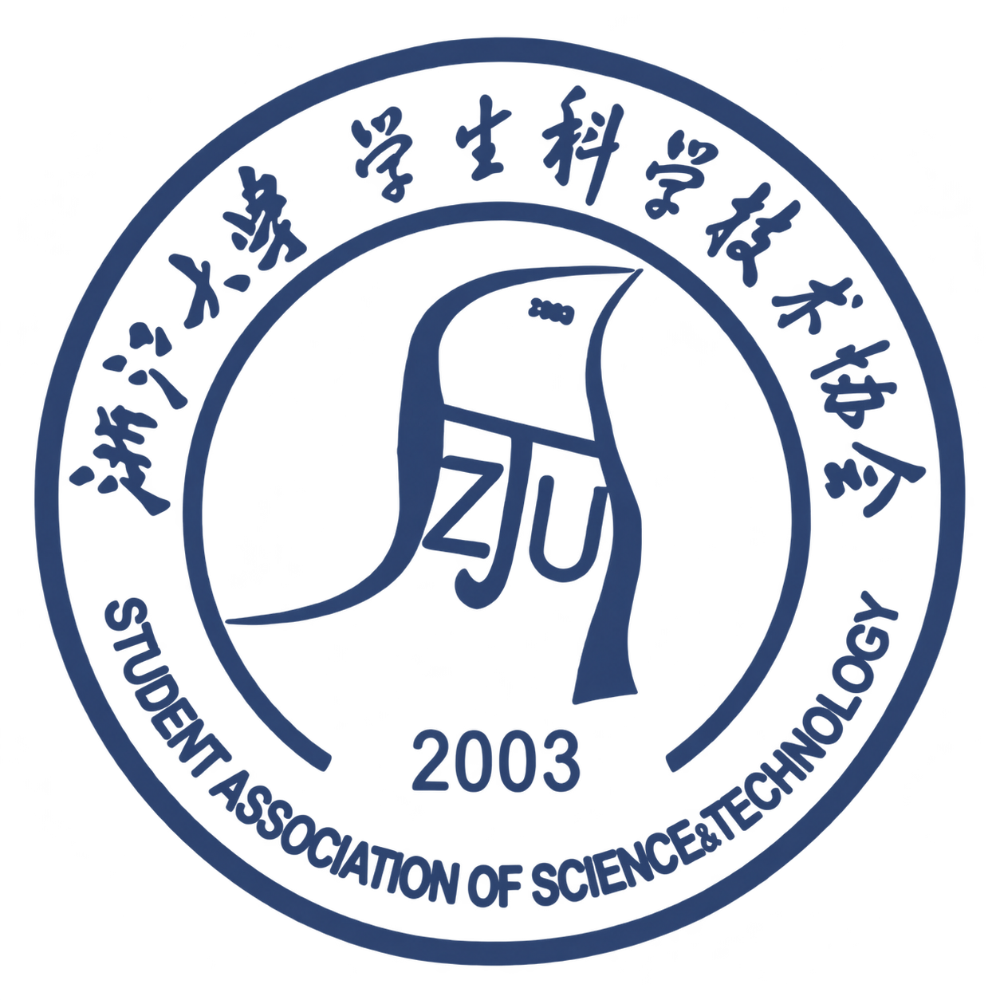
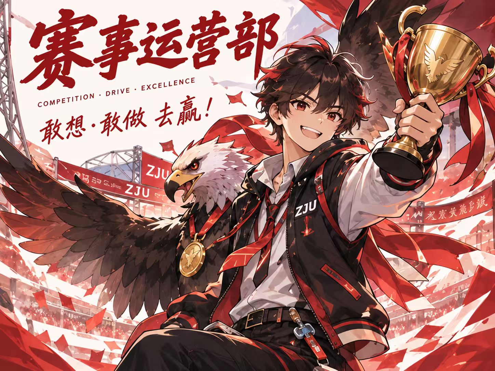
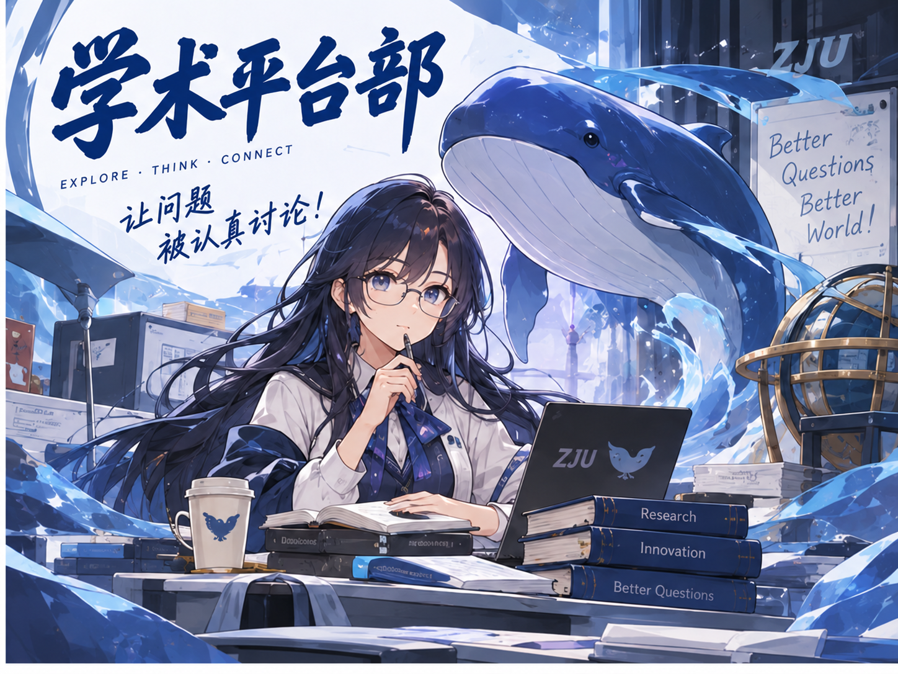
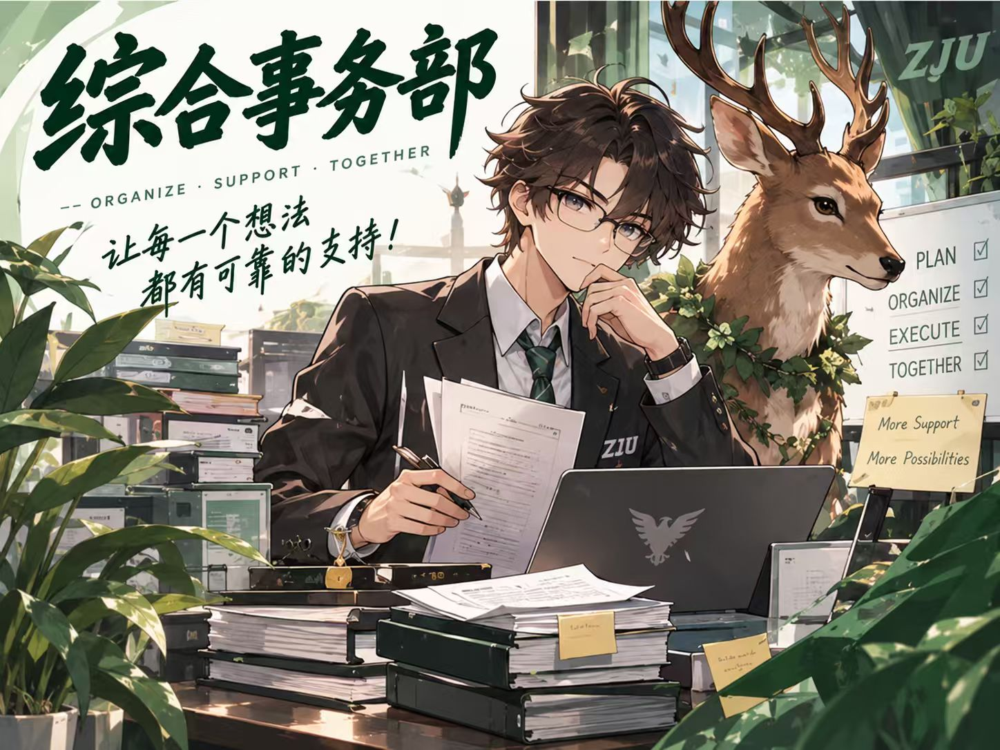
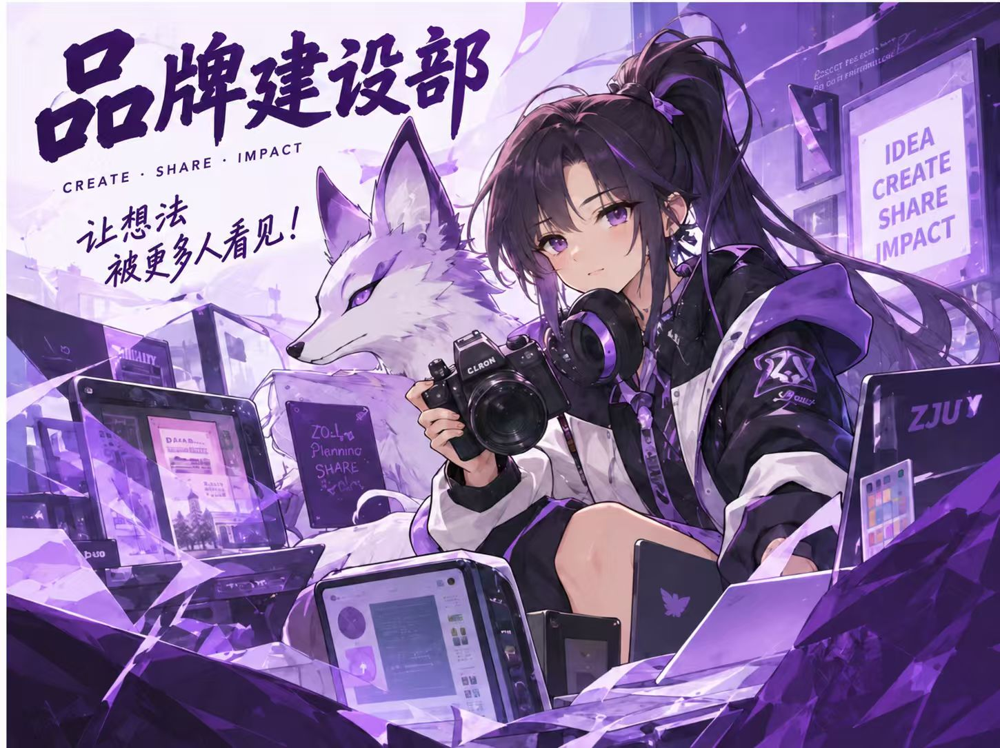

  

# SAST-TI · 科创人格探索

**你的脑洞，属于哪一派？**

有人让想法发生，有人让问题清晰，有人让彼此同行，有人让价值被看见。SAST-TI 是浙江大学学生科学技术协会推出的科创人格探索测试：跟随四幕故事，完成 16 道情境选择题，在 16 种科创人格里，遇见自己更自然的思考与行动方式。

[开始探索](https://xiao-yu-gg.github.io/sast-ti/) · [认识学生科协](https://xiao-yu-gg.github.io/sast-ti/#/sast) · [纳新报名](https://xiao-yu-gg.github.io/sast-ti/#/join)

## 从一个选择，认识一种可能

- **沉浸式情境测试**：沿着四幕故事作答，随时回看已经走过的情景。每轮的选项顺序随机，答题过程中保持不变。
- **16 种人格与四色图鉴**：查看人格介绍、四维偏好和可能感兴趣的部门；也可以通过朋友分享的卡片，遇见另一种脑洞。
- **专属竖版人格卡**：生成 1080 × 1920 的分享卡，四维比例可以自由开关，预览与保存的图片一致。卡片底部分别标注“扫码获得人格卡片”和“扫码参与抽奖”，两个入口融入白色卡面。
- **保留每次探索**：无需登录，作答进度与历史结果保存在当前浏览器，可继续未完成的测试。

“科创人格探索”测试结果仅供参考，不作为任何参考依据，欢迎您来浙江大学学生科学技术协会。每一种人格都可以走向不同的部门，兴趣与真实体验同样重要。

## 关于浙江大学学生科学技术协会

**Any one，Any idea。**

浙江大学学生科学技术协会（以下简称“学生科协”）于2003年成立，是全校唯一覆盖文、理、工、农、医的综合性学生科学技术组织，在校党委的领导和校团委的指导下开展工作，联系校领导为校长马琰铭院士。 自成立以来，学生科协以“Any one，Any idea”为宗旨，积极促进学术交流，服务技术创新，致力于打造集校内外创新创业交流服务为一体的平台，努力推动“会读书的人”成为“会创造的人”，为建设世界一流的综合型、研究型、创新型大学贡献青年智慧与力量。

学生科协每年承办或协办“挑战杯”、创新大赛、“蒲公英”大赛等校内外重大科创赛事，统筹各级各类科创竞赛的校内组织发动与报名工作；常态性、高频次、非标准化开展“大学小创”、“圆桌会议”等主题沙龙和系列论坛；开设《创新·创业·创赛》等特色课程，持续与知名校友、专家学者、优秀学子等开展深度交流，以头部资源供给拓展认知格局，让优秀的青年学子培养带动更多的青年学子。

## 四个部门，四种参与的起点

### 赛事运营部

化身赛场的猎鹰，锚定各类科创赛事🗡️

协助校团委承办“蒲公英”大学生创新大赛，包揽校内各大科创赛事的宣传、组织与报名统筹🎉

以锐利视野洞察赛场，做你科创路上的坚实后盾，助你的创新才华乘风展翅、天际翱翔🫵🏻

[走近赛事运营部](https://xiao-yu-gg.github.io/sast-ti/#/sast/departments/events)

### 学术平台部

化身学术交流的筑台人，链接师生思想与智慧火花💡

常态化、高频次、非标准化开展“大学小创”“圆桌会议”等主题沙龙与系列论坛，营造“小而精”的师生交流氛围🎉

用细致服务为“青青计划”的日常开展保驾护航，让每一次灵感碰撞落地生花、让每一份学术热爱蓬勃生长🫵🏻

[走近学术平台部](https://xiao-yu-gg.github.io/sast-ti/#/sast/departments/academic)

### 综合事务部

化身科协高效运转的“大管家”，统筹日常事务，串联部门协作与组织脉络🧩

细致做好值班安排、财务管理、会议组织、公示发布与志愿证明等工作，用规范流程守护科协的每一次有序运行📋

以认真负责托起每一项工作落地，用耐心沟通凝聚每一份青春力量，让协作更加顺畅、让热爱更有回响🫶🏻

[走近综合事务部](https://xiao-yu-gg.github.io/sast-ti/#/sast/departments/affairs)

### 品牌建设部

化身科协科创故事的 “造光者”，捕捉科创闪光瞬间，打造属于科协的对外声量与视觉名片

深耕推文创作、海报视觉、账号运营、科普活动与精品课程打造，用文字、画面与创意，把硬核科创变得鲜活有趣

以奇思妙想解锁内容无限可能，用创意传播放大每一份科创热爱，让想法被看见，让科创更出圈

[走近品牌建设部](https://xiao-yu-gg.github.io/sast-ti/#/sast/departments/brand)

## 加入学生科协

让一个脑洞，遇见一群同行的人。欢迎扫码填写浙江大学学生科学技术协会纳新报名问卷。

  

<strong>纳新报名问卷</strong> 使用微信扫码，或长按识别二维码。

[打开网页报名入口](https://xiao-yu-gg.github.io/sast-ti/#/join)

这里是加入科协的报名问卷入口；分享卡上的抽奖小程序码用于参与抽奖。
